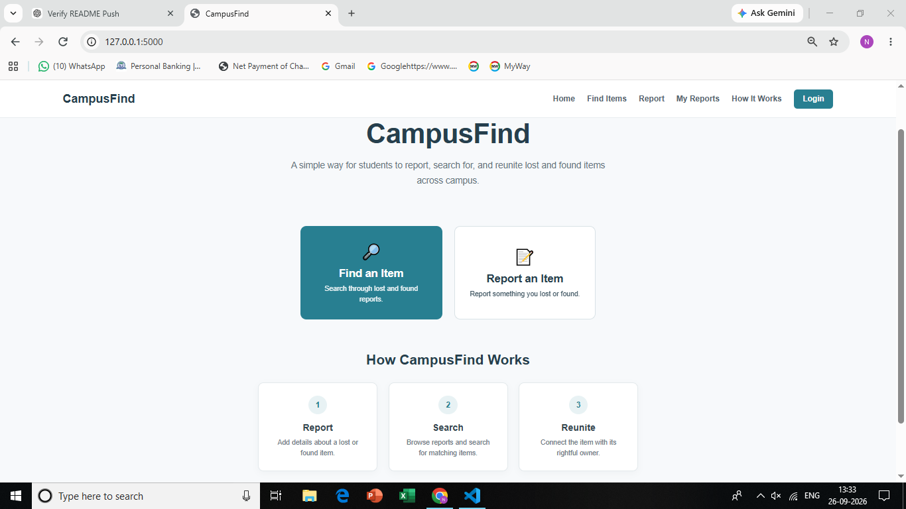
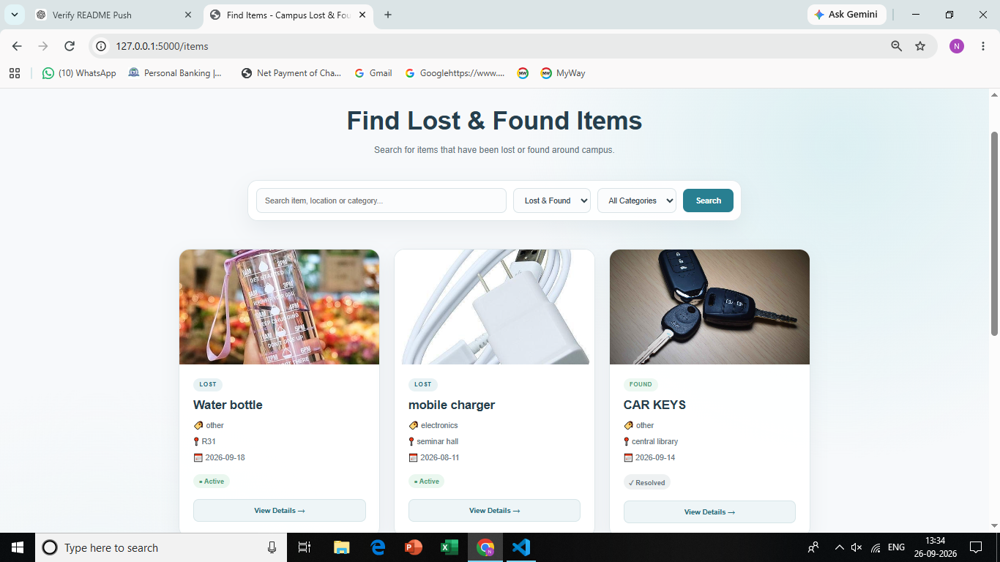
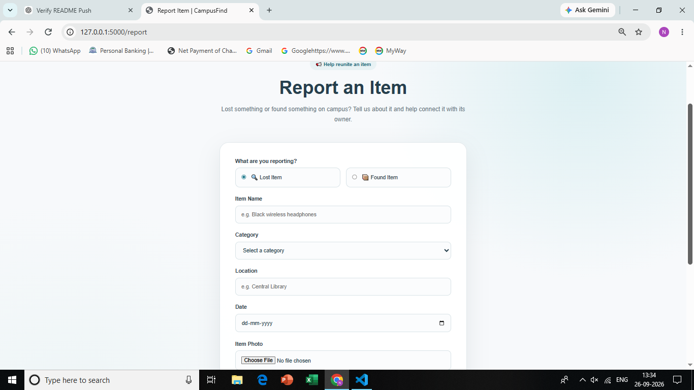
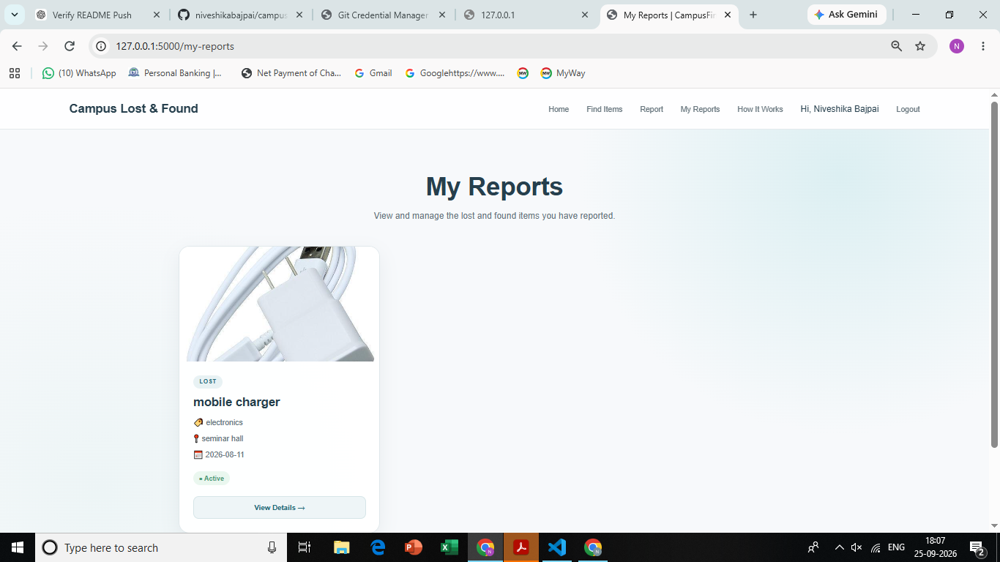

# CampusFind 🎓

CampusFind is a campus-based Lost & Found web application that helps students report, search, and manage lost and found items in one place.

## ✨ Features

* 🔐 User registration and login
* 📌 Report lost or found items
* 🔎 Search and filter reported items
* 📷 Upload images of items
* 👤 View your own reports
* ✏️ Edit and delete your reports
* ✅ Mark items as resolved
* 📩 Contact the reporter
* 📱 Responsive user interface

## 🛠️ Tech Stack

* **Frontend:** HTML, CSS
* **Backend:** Python, Flask
* **Database:** SQLite
* **Templating:** Jinja2
* **Version Control:** Git & GitHub

## 📂 Project Structure

```text
campus-lost-found/
│
├── app.py
├── requirements.txt
├── .gitignore
│
├── static/
│   ├── style.css
│   └── uploads/
│
├── templates/
│   ├── index.html
│   ├── login.html
│   ├── signup.html
│   ├── items.html
│   ├── report.html
│   └── ...
│
└── screenshots/
    ├── home.png
    ├── find-items.png
    ├── reports.png
    └── my-reports.png
```

## 🚀 How to Run

1. Clone the repository.
2. Create and activate a virtual environment.
3. Install the required dependencies.
4. Run the Flask application.
5. Open the local server in your browser.

## 🎯 Purpose

CampusFind was created as a beginner-friendly web development project to make reporting and finding lost items easier within a campus environment.

## 📸 Screenshots

### Home Page



### Find Items



### Report an Item



### My Reports


